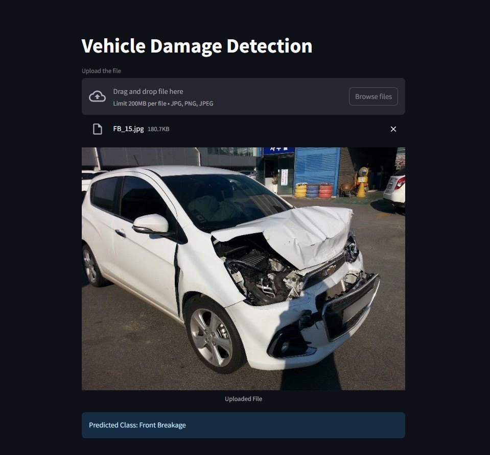

# Vehicle Damage Prediction

\<br\>

Transforming Vehicle Damage Assessment with AI Precision
\<br\>
This app let's you drag and drop an image of a car and it will tell you what kind of damage it has.
The model is trained on third quarter front and rare view hence the picture should capture the third quarter front or rare view of a car. 
\<br\>

\<br\>
### Model Details
1. Used ResNet50 for transfer learning
2. Model was trained on around 1700 images with 6 target classes
   1. Front Normal
   1. Front Crushed
   1. Front Breakage
   1. Rear Normal
   1. Rear Crushed
   1. Rear Breakage
9. The accuracy on the validation set was around 80%
\<br\>
Built with the tools and technologies:
\<br\>

-----

## Table of Contents

  * [Overview]
  * [Getting Started]
      * [Prerequisites]
      * [Installation]
  * [Usage]
  * [Testing]

-----

## Overview

dl-project-vehicle-damage-prediction is an **AI-powered tool** designed to streamline vehicle damage assessment through an intuitive web interface. It leverages a fine-tuned ResNet50 model to classify damage types from uploaded images, enabling quick and accurate inspections.

### Why dl-project-vehicle-damage-prediction?

This project simplifies damage detection workflows with features including:

  * **Model Integration**: Seamlessly loads and utilizes a trained deep learning model for precise damage classification.
  * **User Interface**: Facilitates easy image uploads and displays real-time prediction results for quick assessments.
  * **Environment Consistency**: Uses `requirements.txt` to ensure reliable setup across development environments.
  * **Focused Detection**: Specializes in third-quarter front and rare view images, addressing specific inspection scenarios.
  * **Fast Inference**: Supports rapid damage evaluation, ideal for vehicle inspection workflows.

-----

## Getting Started

### Prerequisites

This project requires the following dependencies:

  * Programming Language: **Python**
  * Package Manager: **Pip**

### Installation

Build dl-project-vehicle-damage-prediction from the source and install dependencies:

1.  **Clone the repository:**
    ```bash
    git clone https://github.com/ShaileshLambode/dl-project-vehicle-damage-prediction
    ```
2.  **Navigate to the project directory:**
    ```bash
    cd dl-project-vehicle-damage-prediction
    ```
3.  **Install the dependencies:**
    Using `pip`:
    ```bash
    pip install -r requirements.txt
    ```

-----

## Usage

Run the project with:
Using `pip`:

```bash
python {entrypoint}
```

-----

## Testing

dl-project-vehicle-damage-prediction uses the **{test\_framework}** test framework. Run the test suite with:
Using `pip`:

```bash
pytest
```
